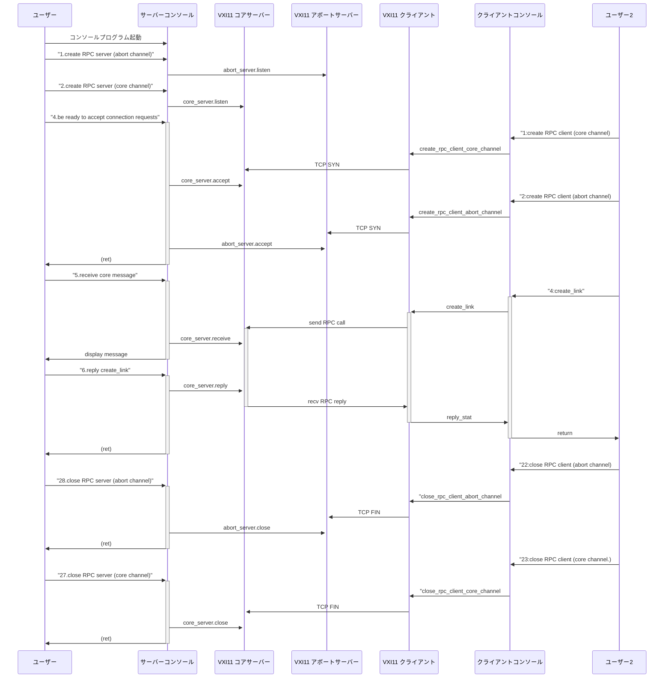
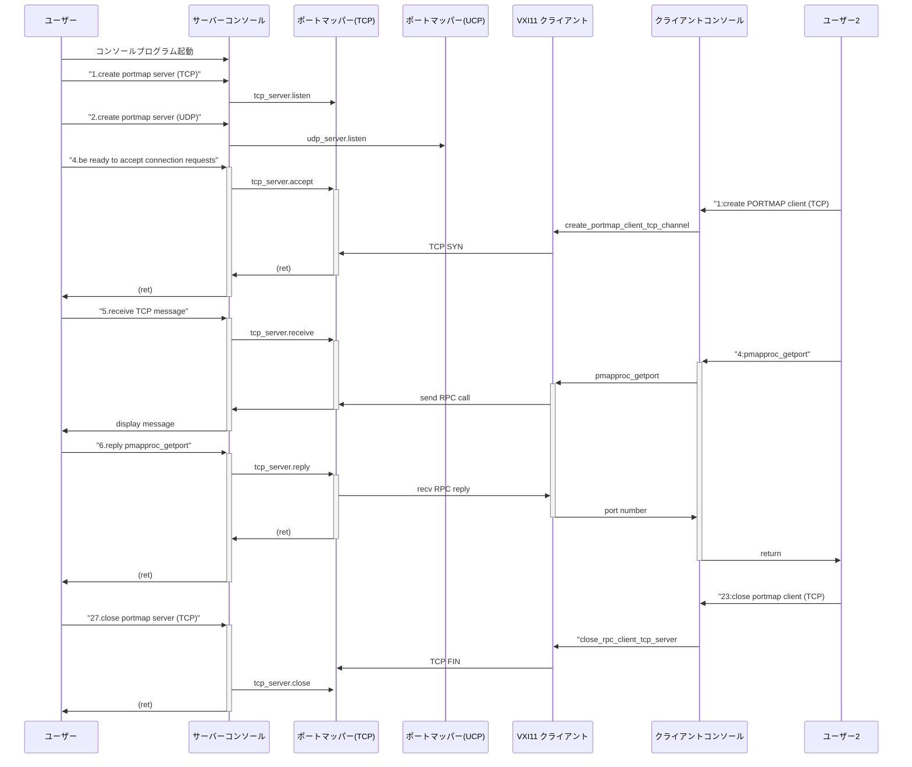

# test tmctl api

```mermaid
sequenceDiagram
participant user as ユーザー
participant test as テスト
participant portmapu as ポートマッパー(UCP)
participant portmapt as ポートマッパー(TCP)
participant vxi11core as VXI11  コアサーバー
participant vxi11abort as VXI11 アボートサーバー
participant vxi11client as VXI11  クライアント
participant tmctl as TmctlAPINet

user ->> test: run demo server（ポート番号:5046)
    test ->> vxi11abort: run demo server
        vxi11abort ->>+ vxi11abort: vxi11abort: Task.Run(() => abort_server
        vxi11abort ->> vxi11abort: abort_server.listen
    test ->> vxi11core: run demo server
        vxi11core ->>+ vxi11core: Task.Run(() => core_server
        vxi11core ->> vxi11core: create_core_channel
        vxi11core ->> vxi11core: core_server.listen
    test ->> portmapt: run demo server（ポート番号:5046)
        portmapt ->>+ portmapt : Task.Run(() => tcp server
        portmapt ->> portmapt: tcp_server.listen
    test ->> portmapu: run demo server（ポート番号:5046)
        portmapu ->>+ portmapu : Task.Run(() => udp server
        portmapu ->> portmapu: udp_server.listen
    test ->> portmapt : pmapproc_set(TCP, 5046)
    test ->> portmapt : pmapproc_set(UDP, 5046)
    test ->> portmapu : pmapproc_set(TCP, 5046)
    test ->> portmapu : pmapproc_set(UDP, 5046)
test ->> user: (ret)

user ->>+ test: Test Search
    test ->>+ tmctl: TmcSearch
        tmctl ->>+ vxi11client: pmapproc_getport
            vxi11client ->> portmapu: send RPC call
                portmapu ->> portmapu: udp_server.receive
                portmapu ->> portmapu: udp_server.reply
            portmapu ->> vxi11client: recv RPC reply
        vxi11client ->>- tmctl: port number
    tmctl ->>- test: (ret)
test ->>- user: (ret)

user ->>+ test: Test Initalize
    test ->>+ tmctl: TmcInitialize
        tmctl ->>+ vxi11client: pmapproc_getport
            vxi11client ->> portmapt: TCP SYN
                portmapt ->> portmapt: tcp_server.accept
            vxi11client ->> portmapt: send RPC call
                portmapt ->> portmapt: tcp_server.receive
                portmapt ->> portmapt: tcp_server.reply
            portmapt ->> vxi11client: recv RPC reply
        vxi11client ->>- tmctl: port number
        portmapt ->> portmapt: tcp_server.close
 
        tmctl ->> vxi11client: create_rpc_client_core_channel
            vxi11client ->> vxi11core: TCP SYN
                vxi11core ->> vxi11core: accept_connection_requests

        tmctl ->>+ vxi11client: create_link
            vxi11client ->>+ vxi11core: send RPC call
                vxi11core ->> vxi11core: receive_message
                vxi11core ->> vxi11core: receive_create_link
                vxi11core ->> vxi11core: reply_create_link
            vxi11core ->>- vxi11client: recv RPC reply
        vxi11client ->>- tmctl: reply_stat

        tmctl ->> vxi11client: create_rpc_client_abort_channel
            vxi11client ->> vxi11abort: TCP SYN
                vxi11abort ->> vxi11abort: abort_server.accept

    tmctl ->>- test: (ret)
test ->>- user: (ret)

user ->>+ test: Test Send
    test ->>+ tmctl: TmcSend
        tmctl ->>+ vxi11client: device_write
            vxi11client ->>+ vxi11core: send RPC call
                vxi11core ->> vxi11core: receive_message
                vxi11core ->> vxi11core: receive_device_write
                vxi11core ->> vxi11core: reply_device_write
            vxi11core ->>- vxi11client: recv RPC reply
        vxi11client ->>- tmctl: reply_stat
    tmctl ->>- test: (ret) 
test ->>- user: (ret)

user ->>+ test: Test Receive
    test ->>+ tmctl: TmcRecevie
        tmctl ->>+ vxi11client: device_read
            vxi11client ->>+ vxi11core: send RPC call
                vxi11core ->> vxi11core: receive_device_read
                vxi11core ->> vxi11core: reply_device_read
            vxi11core ->>- vxi11client: recv RPC reply
        vxi11client ->>- tmctl: reply_stat
    tmctl ->>- test: (ret) 
test ->>- user: (ret)

user ->>+ test: dummy
    test ->>+ tmctl: TmcFinish
        tmctl ->>+ vxi11client: destroy_link
            vxi11client ->>+ vxi11core: send RPC call
                vxi11core ->> vxi11core: receive_device_link
                vxi11core ->> vxi11core: reply_device_error
            vxi11core ->>- vxi11client: recv RPC reply
        tmctl ->>+ vxi11client: Close
            vxi11client ->> vxi11core: TCP FIN
        vxi11core ->> vxi11core: core_server.close
            vxi11client ->> vxi11abort: TCP FIN
        vxi11abort ->> vxi11abort: abort_server.close
    tmctl ->>- test: (ret) 
test ->>- user: (ret)

user ->>+ test: "stop demo server"
    test ->> portmapu: shutdown
        portmapu ->>- portmapu: udp_server.shutdown
    test ->> portmapt: shutdown
        portmapt ->>- portmapt: tcp_server.shutdown
    test ->> vxi11core: core_server.shutdown
        vxi11core ->>- vxi11core: core_server.shutdown
    test ->> vxi11abort: abort_server.shutdown
        vxi11abort ->>- vxi11abort: abort_server.shutdown
test ->>- user: (ret)
```

# test vxi-11 handler

```mermaid
sequenceDiagram
participant user as ユーザー
participant server_console as サーバーコンソール
participant vxi11core as VXI11  コアサーバー
participant vxi11abort as VXI11 アボートサーバー
participant vxi11client as VXI11  クライアント
participant client_console as クライアントコンソール
participant user2 as ユーザー2

user ->> server_console: コンソールプログラム起動
user ->> server_console: "1.create RPC server (abort channel)"
    server_console ->> vxi11abort: abort_server.listen
user ->> server_console: "2.create RPC server (core channel)"
    server_console ->> vxi11core: core_server.listen

user ->>+ server_console: "4.be ready to accept connection requests"
user2 ->> client_console: "1:create RPC client (core channel)
    client_console ->> vxi11client: create_rpc_client_core_channel
        vxi11client ->> vxi11core: TCP SYN
    server_console ->>+ vxi11core: core_server.accept
user2 ->> client_console: "2:create RPC client (abort channel)
    client_console ->> vxi11client: create_rpc_client_abort_channel
        vxi11client ->> vxi11abort: TCP SYN
    server_console ->>+ vxi11abort: abort_server.accept
server_console ->>- user: (ret)

user ->>+ server_console: "5.receive core message"
user2 ->>+ client_console: "4:create_link"
    client_console ->>+ vxi11client: create_link
        vxi11client ->>+ vxi11core: send RPC call
    server_console ->> vxi11core: core_server.receive
server_console ->>- user: display message
user ->>+ server_console: "6.reply create_link"
    server_console ->> vxi11core: core_server.reply
        vxi11core ->>- vxi11client: recv RPC reply
    vxi11client ->>- client_console: reply_stat
client_console ->>- user2: return
server_console ->>- user: (ret)

user2 ->> client_console: "22:close RPC client (abort channel)
user ->>+ server_console: "28.close RPC server (abort channel)"
    client_console ->> vxi11client: "close_rpc_client_abort_channel
        vxi11client ->> vxi11abort: TCP FIN
    server_console ->>+ vxi11abort: abort_server.close
server_console ->>- user: (ret)
user2 ->> client_console: "23:close RPC client (core channel.)
user ->>+ server_console: "27.close RPC server (core channel)"
    client_console ->> vxi11client: "close_rpc_client_core_channel
        vxi11client ->> vxi11core: TCP FIN
    server_console ->>+ vxi11core: core_server.close
server_console ->>- user: (ret)　
```

# test portmap handler

```mermaid
sequenceDiagram
participant user as ユーザー
participant server_console as サーバーコンソール
participant portmapt as ポートマッパー(TCP)
participant portmapu as ポートマッパー(UCP)
participant vxi11client as VXI11  クライアント
participant client_console as クライアントコンソール
participant user2 as ユーザー2

user ->> server_console: コンソールプログラム起動
user ->> server_console: "1.create portmap server (TCP)"
    server_console ->> portmapt: tcp_server.listen
user ->> server_console: "2.create portmap server (UDP)"
    server_console ->> portmapu: udp_server.listen

user ->>+ server_console: "4.be ready to accept connection requests"
    server_console ->>+ portmapt: tcp_server.accept
user2 ->> client_console: "1:create PORTMAP client (TCP)
    client_console ->> vxi11client: create_portmap_client_tcp_channel
        vxi11client ->> portmapt: TCP SYN
    portmapt ->>- server_console: (ret)
server_console ->>- user: (ret)

user ->>+ server_console: "5.receive TCP message"
    server_console ->>+ portmapt: tcp_server.receive
user2 ->>+ client_console: "4:pmapproc_getport"
    client_console ->>+ vxi11client: pmapproc_getport
        vxi11client ->> portmapt: send RPC call
    portmapt ->>- server_console:　
server_console ->>- user: display message
user ->>+ server_console: "6.reply pmapproc_getport"
    server_console ->>+ portmapt: tcp_server.reply
        portmapt ->> vxi11client: recv RPC reply
    vxi11client ->>- client_console: port number
    portmapt ->>- server_console: (ret)　
client_console ->>- user2: return
server_console ->>- user: (ret)

user2 ->> client_console: "23:close portmap client (TCP)
user ->>+ server_console: "27.close portmap server (TCP)"
    client_console ->> vxi11client: "close_rpc_client_tcp_server
        vxi11client ->> portmapt: TCP FIN
    server_console ->>+ portmapt: tcp_server.close
server_console ->>- user: (ret)
```

